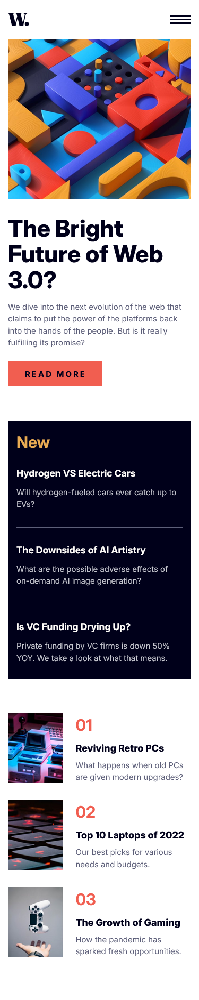
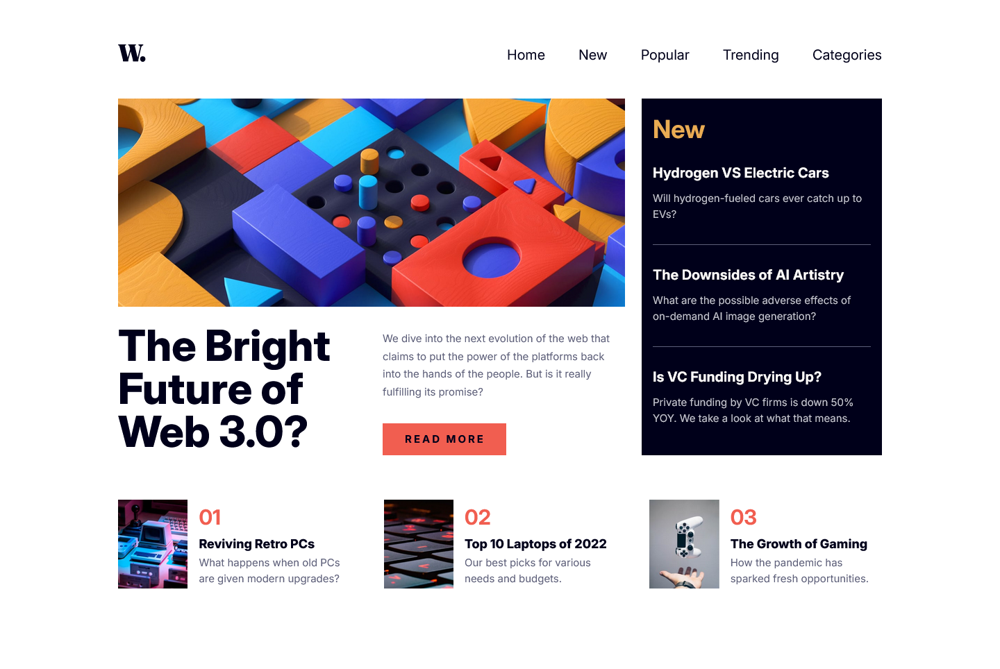

# Frontend Mentor - News homepage solution

This is a solution to the [News homepage challenge on Frontend Mentor](https://www.frontendmentor.io/challenges/news-homepage-H6SWTa1MFl). Frontend Mentor challenges help you improve your coding skills by building realistic projects.

## Table of contents

- [Overview](#overview)
  - [The challenge](#the-challenge)
  - [Screenshot](#screenshot)
  - [Links](#links)
- [My process](#my-process)
  - [Built with](#built-with)
  - [What I learned](#what-i-learned)
  - [Continued development](#continued-development)
  - [Useful resources](#useful-resources)
- [Author](#author)
- [Acknowledgments](#acknowledgments)

## Overview

### The challenge

Users should be able to:

- View the optimal layout for the interface depending on their device's screen size
- See hover and focus states for all interactive elements on the page

### Screenshot




### Links

- Solution URL: [Add solution URL here](https://your-solution-url.com)
- Live Site URL: [Add live site URL here](https://your-live-site-url.com)

## My process

### Built with

- Semantic HTML5 markup
- CSS custom properties
- Flexbox
- CSS Grid
- Mobile-first workflow
- JavaScript for accessible mobile navigation (menu toggle)

**Note: These are just examples. Delete this note and replace the list above with your own choices**

### What I learned

This project helped reinforce:

Building responsive layouts using CSS Grid and Flexbox together.

Managing toggle states in JavaScript with aria-\* attributes for accessibility.

Using picture elements for responsive image switching.

Writing semantic HTML with section, article, nav, and header tags.

Example snippet for toggling the mobile menu:

```
function expandMenu() {
  openMenu.setAttribute("aria-expanded", "true");
  nav.classList.remove("hidden");
  nav.classList.add("grid");
  overlay.classList.remove("hidden");
  document.body.classList.add("no-scroll");
}
```

### Continued development

In future projects, I want to refine:

Using ARIA attributes for more robust accessibility

Creating a CSS utility system for spacing and layout

Animating navigation transitions and overlay fades smoothly

### Useful resources

- [Example resource 1](https://www.frontendmentor.io) - All resources learned are all linked here

## Author

- Website - [Add your name here](https://pastasus.github.io/news-homepage-main/)
- Frontend Mentor - [@yourusername](https://www.frontendmentor.io/profile/PastaSus)
